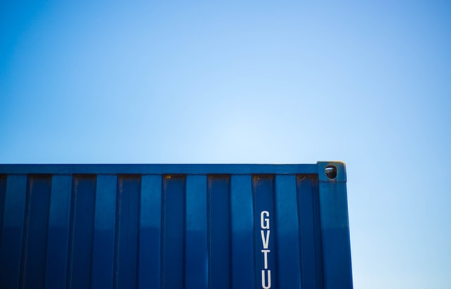

# The Debian Client Container for me

### *Debian container packed with software tools I expect from a linux container*

My linux distribution of choice would be [DEBIAN](https://www.debian.org)
so that's why I choose to work with this one as a starting platform

## Installed software

* procps
* vim
* ssh / sshd
* tcpdump
* ngrep
* nmap
* netcat / nc
* git
* gpg
* mc
* tmux
* net-tools
* ip-route

## Started services

* sshd
* ssh-agent
* nc on port 1234

*I will be using a simple bash script to start these three processes*

## How to work with this

You need to copy your own ssh public keys under the ssh folder, so they can be added to 
the authorized_hosts file under root's account.

